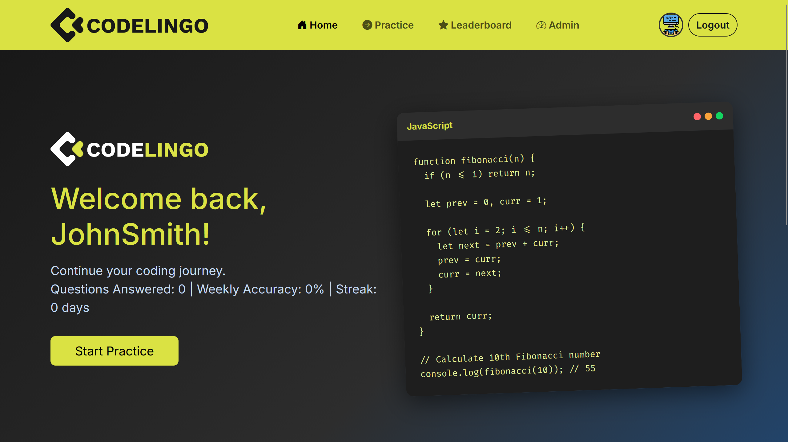
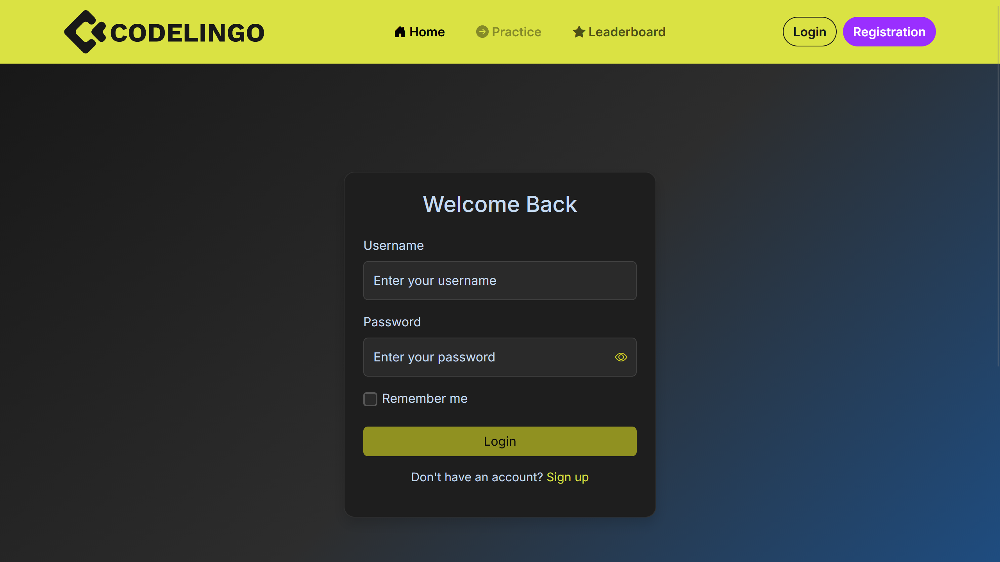
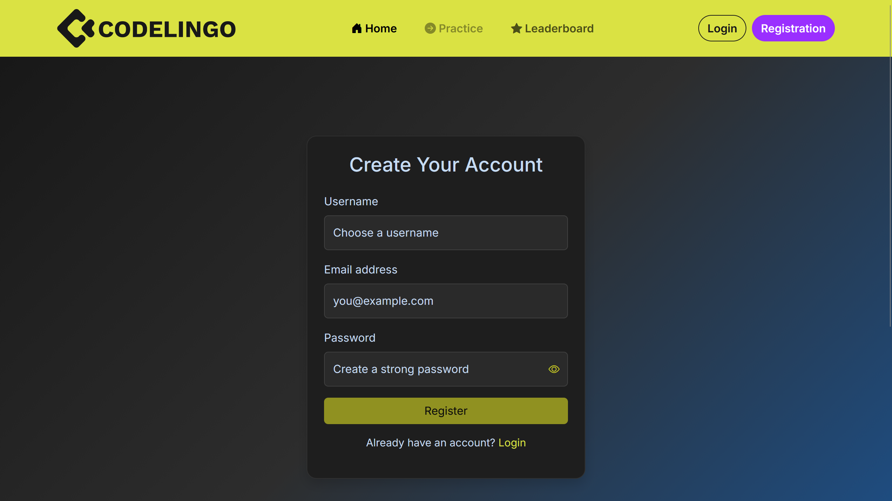
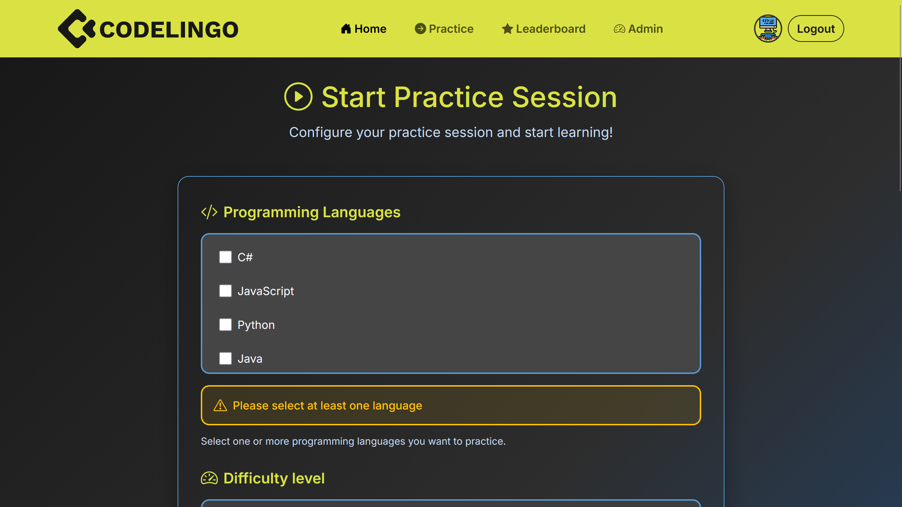
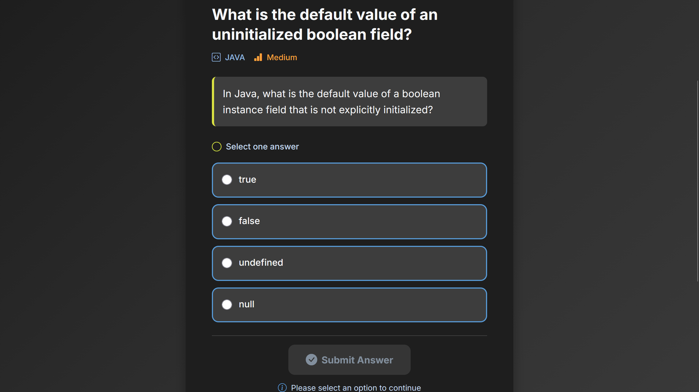
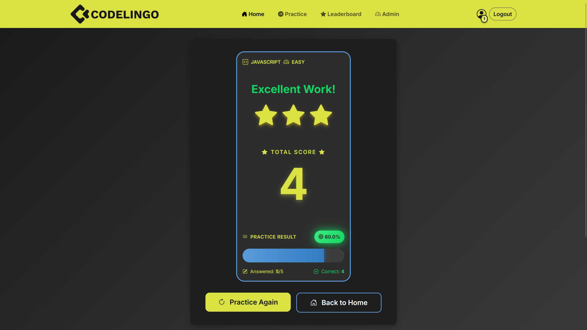
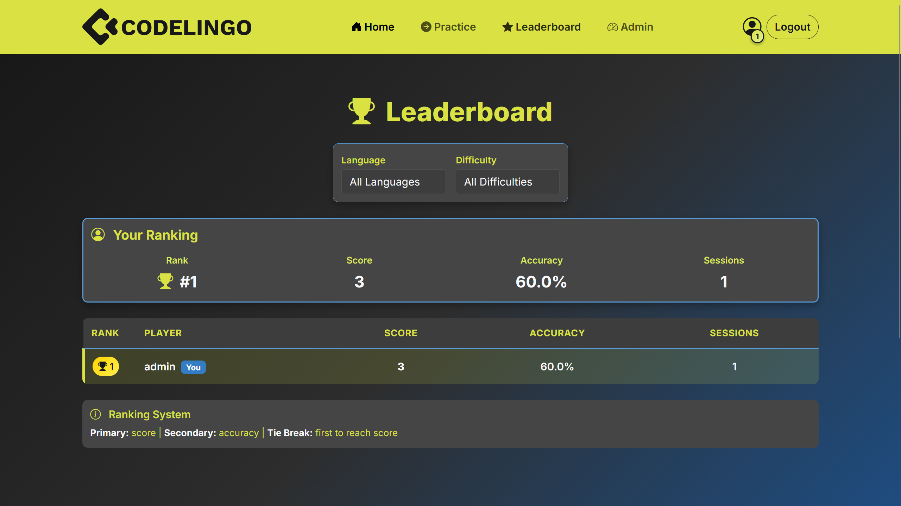
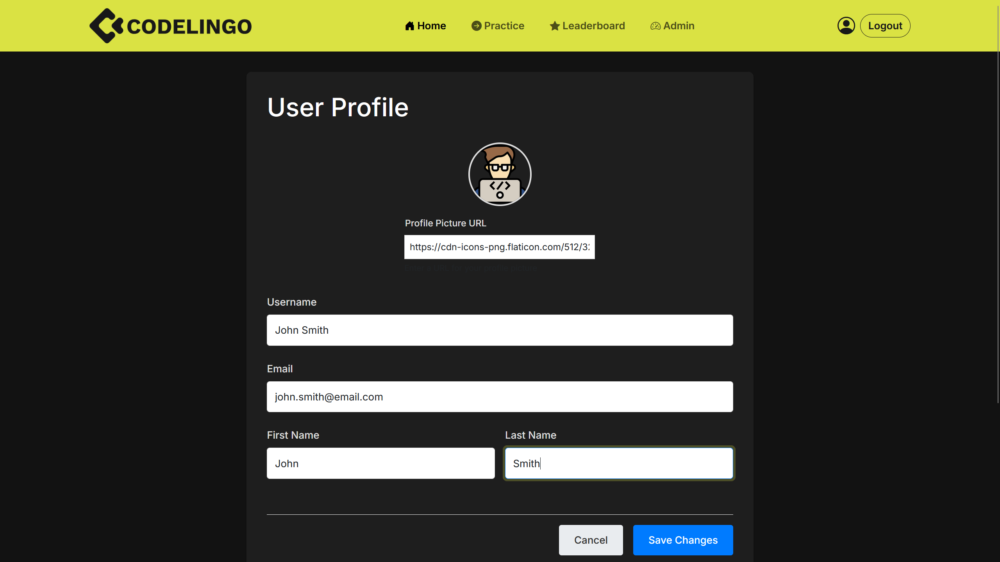
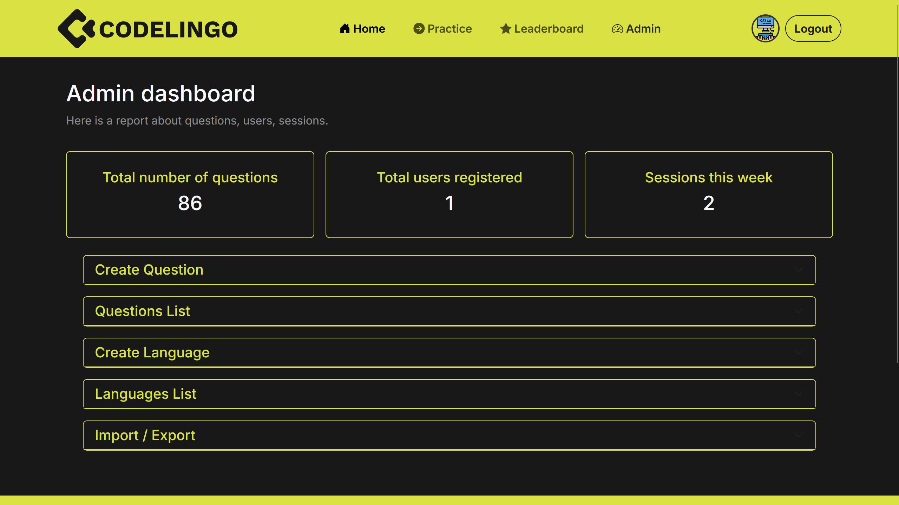

# CodeLingo

- [Task Description](https://github.com/bprof-spec-codes/docs/blob/master/BPROF-2024/%C3%96LAB-2025-26-1/codelingo.md)
- [Code of Conduct](https://github.com/bprof-spec-codes/docs/blob/master/BPROF-2024/ÖLAB-2025-26-1/coc.md)
- [Requirements](https://github.com/bprof-spec-codes/docs/blob/master/BPROF-2024/ÖLAB-2025-26-1/requirements.md)
- **Live Site: [codelingo.hu](https://codelingo.hu)**

---

## 📌 Team
| Name                        | Role                | GitHub Profile |
|-----------------------------|---------------------|----------------|
| Tamás Tisza                 | Manager             | [TiszaTamas](https://github.com/TiszaTamas) |
| Bendegúz András Szczuka     | Architect           | [szczukabendeguz](https://github.com/szczukabendeguz) |
| Olivér Tolnai               | Frontend Developer  | [oli-tolnai](https://github.com/oli-tolnai) |
| Ádám József Prohászka       | Frontend Developer  | [adamprohaszka](https://github.com/adamprohaszka) |
| Bence Kóbori                | Frontend Developer  | [koboribence](https://github.com/koboribence) |
| Mihály Homonnai             | Backend Developer   | [misih26](https://github.com/misih26) |
| Máté Zsebeházi              | Backend Developer   | [MateZsebehazi](https://github.com/MateZsebehazi) |

---

## 📖 Developer Guide

- Tech stack: ASP.NET 8 backend, Angular frontend, Bootstrap UI.
- Branching: GitFlow (master, develop, feature/*, hotfix/*).
- Tasks: GitHub Projects board per sprint columns.
- Meetings: Twice per week per coc.md. Usually thurstday and sunday.

### Live Environment
- **Production URL:** [https://codelingo.hu](https://codelingo.hu)

### Local setup
- Prerequisites: .NET 8 SDK, Node.js LTS, Angular CLI.
- Backend:
  - Open solution: CodeLingo.sln
  - Run API: `dotnet run --launch-profile https`
- Frontend:
  - Open CodeLingo.Frontend
  - Install: `npm install`
  - Run: `ng serve -o`

---

## 🖥️ Usage

### Production
- Visit [https://codelingo.hu](https://codelingo.hu) to use the live application.

### Local Development
1. Start backend and frontend.
2. Backend default URL: http://localhost:7107 (Swagger enabled)
3. Frontend URL: http://localhost:4200

### User Features
- Register/login
- Practice answering questions
- Collect points and levels
- Profile page
- Admin panel

### Default Users
- Admin user
    - username: `admin` password: `Codelingo123!`

---

## 🔌 API Function List
Rövid kivonat. Teljes specifikáció: [docs/technical/api-reference.md](docs/technical/api-reference.md)

- Authentication
  | Endpoint | Method | Description |
  |----------|--------|-------------|
  | `/auth/register` | POST | Register a new user, return JWT and refresh token |
  | `/auth/login` | POST | Log in, return JWT and refresh token |
  | `/auth/token/refresh` | POST | Refresh access token using a refresh token |

- User Management
  | Endpoint | Method | Description |
  |----------|--------|-------------|
  | `/users/me` | GET | Get the authenticated user's profile |
  | `/users/me` | PUT | Update profile |
  | `/users/me/statistics` | GET | Personal stats (total questions, accuracy, streak, rank) |

- Practice Mode
  | Endpoint | Method | Description |
  |----------|--------|-------------|
  | `/sessions/start` | POST | Start a new practice session |
  | `/sessions/{id}/next` | GET | Get the next question or completion state |
  | `/sessions/{id}/answer` | POST | Submit an answer and scoring |
  | `/sessions/{id}/close` | POST | Close the session and return summary |
  | `/sessions/{id}/results` | GET | Detailed session results |

- Progress & Stats
  | Endpoint | Method | Description |
  |----------|--------|-------------|
  | `/users/{id}/stats` | GET | User statistics and progress |
  | `/leaderboard` | GET | Global/filtered leaderboard |

- Admin - Language Management
  | Endpoint | Method | Description |
  |----------|--------|-------------|
  | `/admin/languages` | GET | List languages |
  | `/admin/languages` | POST | Create a new language |
  | `/admin/languages/{id}` | PUT | Update a language |
  | `/admin/languages/{id}` | DELETE | Delete a language |

- Admin - Question Management
  | Endpoint | Method | Description |
  |----------|--------|-------------|
  | `/admin/questions` | GET | List questions with filtering/pagination |
  | `/admin/questions/{id}` | GET | Get detailed question by ID |
  | `/admin/questions` | POST | Create a new question |
  | `/admin/questions/{id}` | PUT | Update a question |
  | `/admin/questions/{id}` | DELETE | Delete a question |

- Admin - Import/Export
  | Endpoint | Method | Description |
  |----------|--------|-------------|
  | `/admin/questions/import` | POST | Import questions (CSV/Aiken, sync/async) |
  | `/admin/questions/import/{jobId}/status` | GET | Import job status |
  | `/admin/questions/export` | GET | Export questions (JSON/CSV/Aiken, sync/async) |
  | `/admin/questions/export/{jobId}/status` | GET | Export job status and download link |

---

## 🖼️ UI Screens

- Landing Page
  - Purpose: Welcome screen with feature highlights and clear CTAs.
  - Key actions: Sign Up, Log In, Start Practice (when logged in).
  
  

- Login
  - Purpose: Authenticate existing users.
  - Key actions: Submit credentials, "Remember me", navigate to Register.
  
  

- Register
  - Purpose: Create a new user account.
  - Key actions: Fill form with validation, navigate to Login after success.
  
  

- Practice Starter
  - Purpose: Configure a new practice session.
  - Key actions: Select language, difficulty, question count; start session.
  - Backend: POST /sessions/start
  
  

- Practice Session
  - Purpose: Show current question, collect answer, proceed to next.
  - Key actions: Submit answer, see feedback, continue.
  - Backend: GET /sessions/{id}/next, POST /sessions/{id}/answer
  
  

- Session Results
  - Purpose: Display session summary and performance.
  - Key actions: Review answers, navigate to leaderboard or start a new session.
  
  

- Leaderboard
  - Purpose: Show rankings and competition stats.
  - Key actions: Filter by range/language, view positions.
  
  

- Profile
  - Purpose: Manage user profile and view personal stats.
  - Key actions: Edit profile, change avatar, review statistics.
  
  

- Admin Panel
  - Purpose: Administer languages, questions, and monitor KPIs.
  - Key actions: CRUD for questions/languages, import/export, dashboard metrics.
  
  

---

## 📝 Problem Log

| Problem | Solution | Affected Area |
|---------|----------|---------------|
| Issue template was hard to understand | Created examples and filled-in templates | Scrum process |
| Project was completely new | Plan issues in the first phase | Scrum process |
| Ticket collisions | Assign similar tickets to the same person | Scrum process |
| Dependent issues got stuck | Prioritize properly | Scrum process |
| Changes weren't merged to master early on | Add merge as a requirement before closing | Git workflow |
| Too many extras in the API | Strive for simplicity | Backend |
| Burnup chart looked off | Ensure issues are properly closed | Scrum process |
