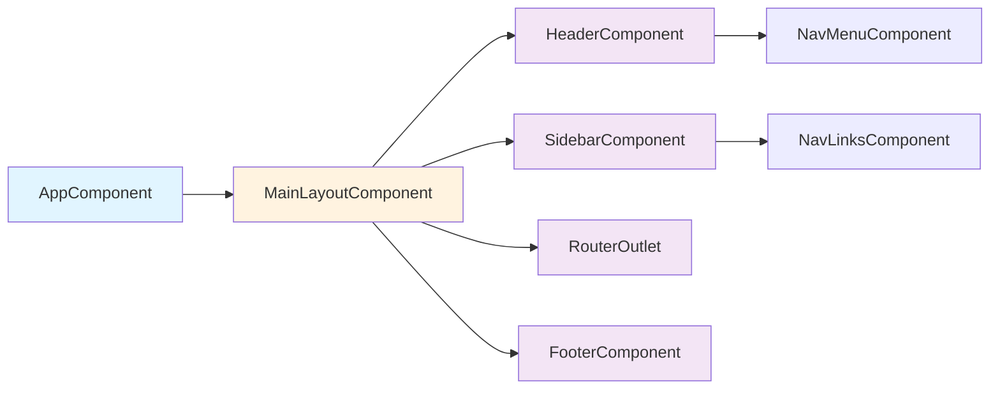
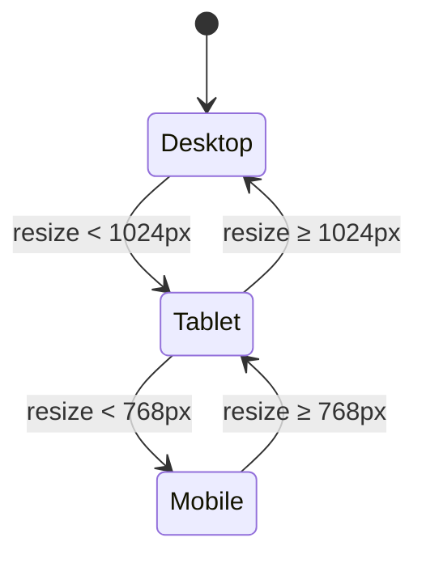
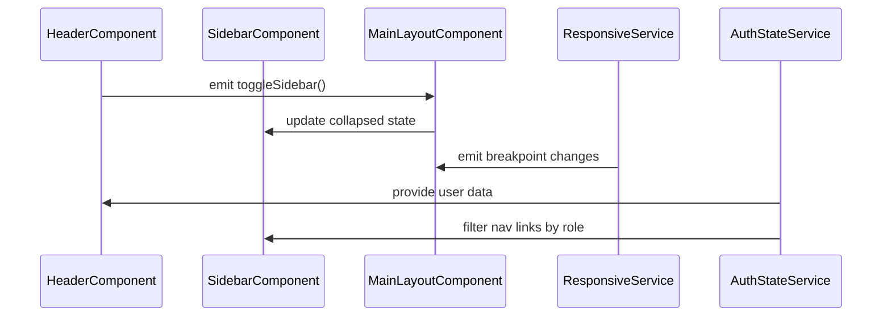

# Main Layout Components Architecture

**Document Version:** 1.0
**Last Updated:** 2025-10-12
**Status:** Draft

## Executive Summary

This document defines the architecture for the **main application shell and layout components** of the **CodeLingo Angular application**.
It establishes the structural foundation of the application, including the app shell, navigation header, sidebar, and footer. It also describes how these components integrate with routing, authentication, and responsive design systems.

The layout follows Angular best practices with a clear separation between layout and feature content. It supports **responsive design, role-based navigation visibility**, and **dynamic content projection** using Angular Router outlets and shared UI services.

---

## Component Hierarchy

### Overview Diagram

| Category                  | Components                                                                | Responsibility                                                                                           |
| ------------------------- | ------------------------------------------------------------------------- | -------------------------------------------------------------------------------------------------------- |
| **Container (Smart)**     | `MainLayoutComponent`, `HeaderComponent`, `SidebarComponent`              | Manage layout state (collapse, expand), handle auth-driven navigation, route transitions, and global UI. |
| **Presentational (Dumb)** | `NavMenuComponent`, `NavLinksComponent`, `FooterComponent`                | Render UI elements, receive data via `@Input()`, emit user interaction events via `@Output()`.           |
| **Utility**               | `LayoutService`, `NavigationService`, `ResponsiveService` | Manage responsive breakpoints, store layout preferences, expose observables for UI and theme state.      |

---

## Layout Composition and Responsibilities
| **Component**         | **Description**                                            | **Key Responsibilities**                                                                    |
| --------------------- | ---------------------------------------------------------- | ------------------------------------------------------------------------------------------- |
| `AppComponent`        | Root shell that initializes routing and global providers.  | Hosts router outlet, global services, error boundary.                                       |
| `MainLayoutComponent` | Primary layout container for authenticated views.          | Manages header, sidebar, content area, and footer; controls responsive breakpoints.         |
| `HeaderComponent`     | Displays application title, user info, and quick actions.  | Integrates with `AuthStateService` and emits navigation or logout actions.                  |
| `SidebarComponent`    | Provides role-based navigation links and collapsible menu. | Observes responsive state, manages active route highlighting, supports keyboard navigation. |
| `FooterComponent`     | Displays footer information (version, copyright).          | Static content with optional dynamic data from app config or environment variables.         |
| `NavMenuComponent`    | Renders horizontal navigation items in header.             | Displays menu items, highlights active routes, supports dropdowns for user profile.         |
| `NavLinksComponent`   | Renders vertical navigation items for sidebar.             | Handles route links, active state detection, and emits navigation events.                   |

---

## Responsive Design and Layout States

### Breakpoint Strategy

- Uses Angular CDK `BreakpointObserver` via `ResponsiveService`.
- Defines breakpoints for:
    - **Mobile:** <768px &rarr; sidebar hidden, toggle via menu icon.
    - **Tablet:** 768–1024px &rarr; collapsible sidebar.
    - **Desktop:** ≥1024px &rarr; persistent sidebar.

#### Layout State Diagram

- `LayoutService` exposes an observable `layoutState$` with current device mode.
- Components subscribe to this observable to adapt UI dynamically.

---

## Authentication and Navigation Integration

- `HeaderComponent` and `SidebarComponent` integrate with the authentication state to display user details and render navigation options according to user roles and permissions.
- Navigation behavior is driven by a centralized configuration managed through the `NavigationService`, which provides filtered navigation items based on authentication state.
- The layout ensures protected routes are accessible only to authenticated users, while navigation visibility dynamically updates when the authentication state changes.

---

## Data Flow and Component Communication

- **Inputs/Outputs:**
    - `HeaderComponent` emits layout events such as sidebar toggling and logout.
    - `SidebarComponent` emits navigation selections.
- **Observables:**
    - `ResponsiveService` emits breakpoint changes.
    - `AuthStateService` emits authentication and user state.
- **LayoutService** coordinates between these streams to ensure consistent UI behavior.

---

## Reusability and Extensibility

- Layout components are designed to be **feature-agnostic** and can be reused across different modules or route groups.
- `MainLayoutComponent` supports **content projection**, allowing different page templates or feature modules to render within the main layout.
- Services such as `LayoutService` and `ResponsiveService` are **globally shared** and maintain consistent behavior across the application.
- Component interfaces and input/output contracts are kept minimal and well-defined to simplify integration with other modules.

---

## Error and State Handling

- Global errors are surfaced through a **generic global error notifier**.
    - This component represents a centralized mechanism for displaying user-friendly error messages, such as toast or snackbar notifications.
- Layout components handle:
    - **Network offline states** (e.g., via a banner).
    - **Session expiration** (auto-redirect to login).
- Persistent UI preferences (e.g., sidebar collapsed state) are cached in `localStorage` via `LayoutService`.