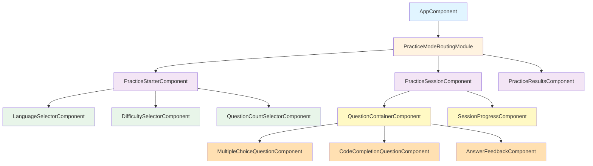
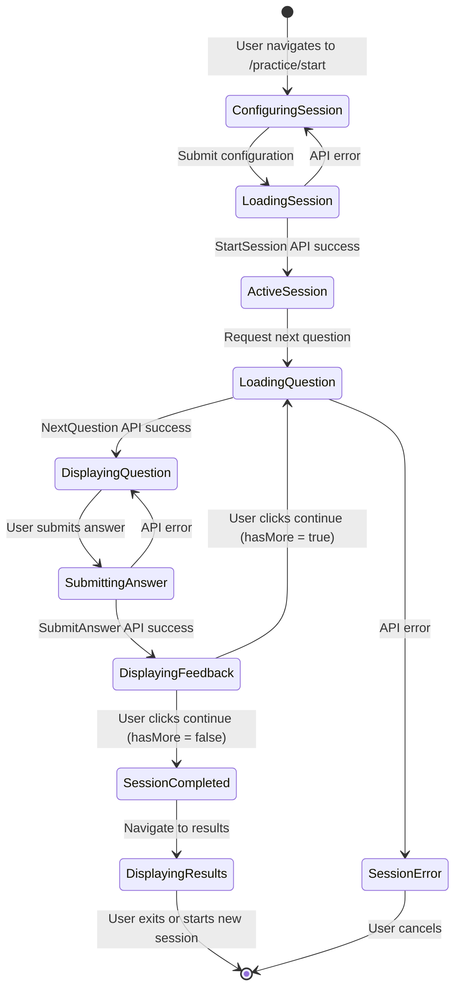
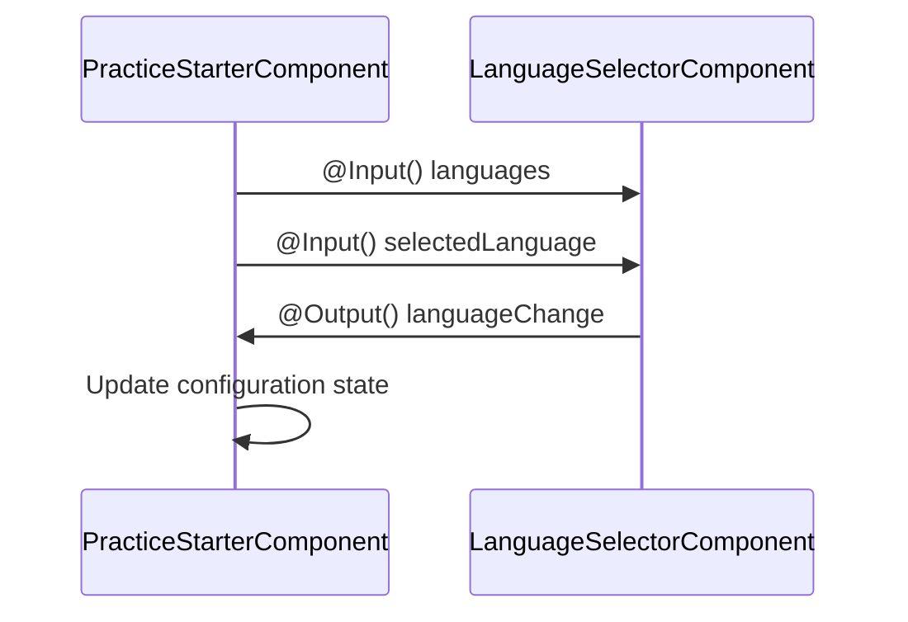
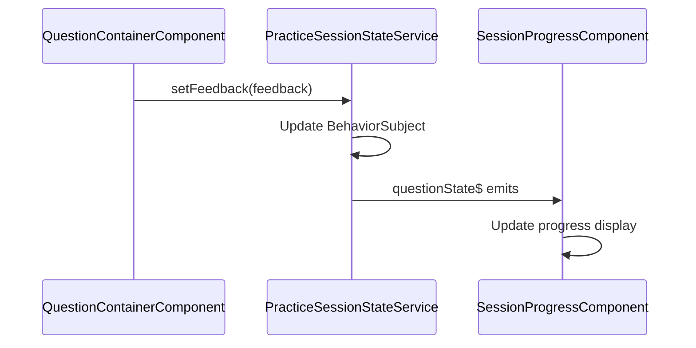
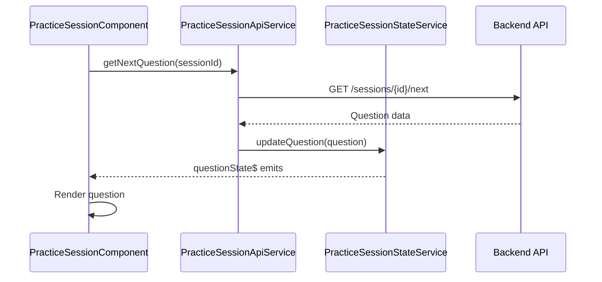

# Practice Mode Components Architecture

**Document Version:** 1.0  
**Last Updated:** 2025-10-04  
**Status:** Draft - Pending Approval

## Executive Summary

This document defines the complete component architecture for CodeLingo's practice mode functionality in Angular. It establishes component hierarchy, state management patterns using RxJS, data flow between components, and integration with backend APIs. The architecture follows Angular best practices including standalone components, smart/dumb component patterns, and reactive state management.

---

## Component Hierarchy

### Overview Diagram

### Component Categories

| Category | Components | Responsibility |
|----------|-----------|----------------|
| **Container (Smart)** | PracticeStarterComponent, PracticeSessionComponent, PracticeResultsComponent | API integration, state management, routing |
| **Feature** | QuestionContainerComponent | Question cycle orchestration, answer submission |
| **Presentational (Dumb)** | LanguageSelectorComponent, DifficultySelectorComponent, QuestionCountSelectorComponent, MultipleChoiceQuestionComponent, CodeCompletionQuestionComponent | Display data, emit events, no business logic |
| **Utility** | SessionProgressComponent, AnswerFeedbackComponent | Progress display, feedback presentation |

### State Flow Diagram

---

## Data Flow Patterns

### Component Communication Patterns

#### 1. Parent-Child Communication (Input/Output)

Used for presentational components communicating with containers:

#### 2. Service-Mediated Communication (State Service)

Used for cross-component state sharing:

#### 3. API Service Pattern

Used for backend communication:

