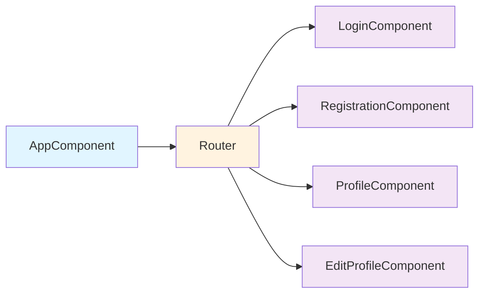
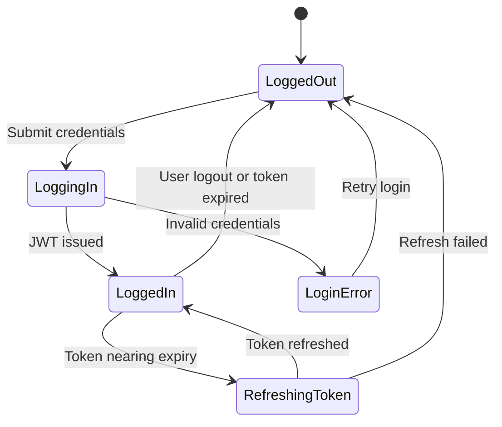
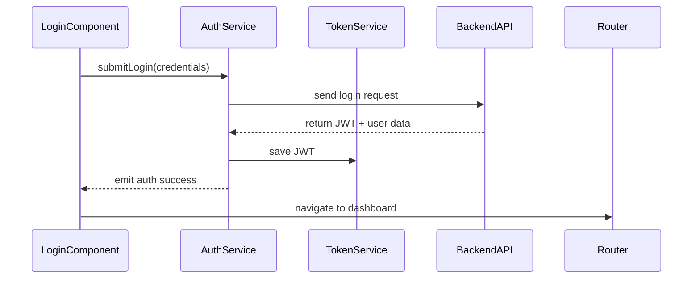

# User Management Components Architecture

**Document Version:** 1.0  
**Last Updated:** 2025-10-07  
**Status:** Draft

## Executive Summary

This document outlines the Angular component architecture for user management functionality including login, registration, and profile management. It specifies component hierarchy, state management patterns (with JWT integration), form validation and error handling strategies, and reusable form and display components. The architecture follows Angular best practices with clean separation between container (smart) and presentational (dumb) components, reactive form patterns, and robust authentication state handling.

---

## Component Hierarchy

### Overview Diagram

### Components Categorization and Responsibilities

| Category                  | Components                                                                                                                        | Responsibility                                                                                                                        |
| ------------------------- | --------------------------------------------------------------------------------------------------------------------------------- | ------------------------------------------------------------------------------------------------------------------------------------- |
| **Container (Smart)**     | `LoginComponent`, `RegistrationComponent`, `ProfileComponent`,`EditProfileComponent`                                              | Handle routing, call services (AuthApi, UserApi), manage high-level state, orchestrate flows (e.g., on success navigate to dashboard) |
| **Feature**               | `AuthModule`, `UserModule`                                                                                                        | Handles authentication and user management features, including routes, guards, and services for secure user flow.                                                   |
| **Presentational (Dumb)** | `LoginFormComponent`, `RegisterFormComponent`, `UserProfileCardComponent`, `EditableUserFormComponent`                            | Display data, emit events, no business logic                                                                                          |
| **Utility**               | `AuthService`, `AuthStateService`, `UserService`, `TokenService`, `ApiErrorInterceptor`, `AuthInterceptor`, `NotificationService` | API wrappers, token management, global error handling, notifications, auth guards                                                     |

---

## Form Validation Patterns

- All forms use **Angular Reactive Forms**.
- **Validation rules:**
  - **Login**: Required email and password, email format validation.
  - **Registration**: Required fields (username, email, password), password strength, confirm password match.
  - **Profile Edit**: Required fields validation with custom validators as needed.
- **Error feedback:**
  - Inline validation messages displayed via `FormErrorsComponent`.
  - Async validators show loading or uniqueness feedback dynamically.

---

## Error Handling

- Centralized error handling strategy via `ApiErrorInterceptor` and `NotificationService`.
- **Form errors:** Map server-side validation errors to corresponding form controls.
- **Global errors:** Network errors, authentication failures, or token issues surfaced through notifications.

---

## Authentication State Management & JWT Integration

- JWT stored securely in-memory or via HttpOnly cookies (avoid localStorage).
- `AuthStateService` exposes observables for authentication state and current user.
- **Route guards** enforce access control based on auth state.
- Token refresh occurs automatically before expiration, subscribers are updated on state changes.

---

## Reusable Form Components and User Data Display

| **Component Name**          | **Purpose**                                 | **Key Features**                                                                                   | **Used In**                               |
| --------------------------- | ------------------------------------------- | -------------------------------------------------------------------------------------------------- | ----------------------------------------- |
| `LoginFormComponent`        | Provides UI for user login.                 | Reactive form with email and password fields, error summary, loading spinner.                      | `LoginComponent`                          |
| `RegisterFormComponent`     | Collects new user details for registration. | Includes name, email, password, confirm password fields with async email validation.               | `RegistrationComponent`                   |
| `EditableUserFormComponent` | Allows updating profile data.               | Dynamic reactive form with patching support, inline validation, and change tracking.               | `EditProfileComponent`                    |
| `FormErrorDisplayComponent` | Displays validation messages.               | Reusable across forms, supports dynamic error types (`required`, `email`, `minlength`, etc.).      | All form components                       |
| `UserProfileCardComponent`  | Displays user info in card layout.          | Read-only display of avatar, username, email, and role. Responsive layout for different viewports. | `ProfileComponent`, `Dashboard`, `Header` |

---

## Data Flow and Component Communication Patterns

- **Parent-child communication:**
  - Forms emit validated payloads to container components.
  - Containers handle orchestration, call services, and navigate on success.
- **Services** mediate API calls, token management, and authentication state.
- **Observables** propagate authentication and error states to interested components (e.g., navigation bar, profile header).
