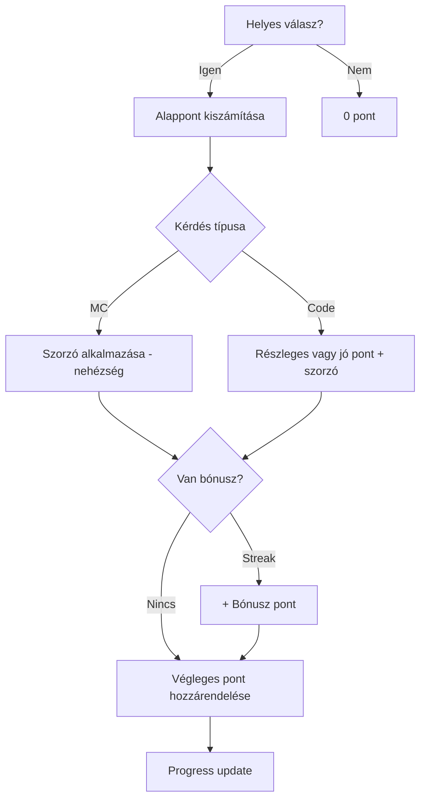

## 1. Business Logic \& Gamification Rules

### 1.1. Pontozás koncepció

- **Helyes válasz:** 10 pont (szorzó a nehézségi szint szerint)
- **Részleges helyes válasz (kód kitöltés):** max pont 80%-a, automatikus vagy manuális értékelés függvényében
- **Helytelen válasz:** 0 pont

#### Difficulty szorzók

| Nehézség | Szorzó |
| :-- | :-- |
| easy | 1.0 |
| medium | 1.5 |
| hard | 2.0 |

#### Kérdés típusonkénti pontozás

| Típus | Alappont | Részleges pontozás | Megjegyzés |
| :-- | :-- | :-- | :-- |
| Multiple choice | 10 | nincs | csak 0 vagy 10 pont |
| Code completion | 15 | max 12 | részleges is lehetséges |

#### Bónusz pontok

- **Streak (n egymás után helyes):** +5 pont minden 5 fős streakért
- **Gyors válasz:** +3 pont ha <10 mp-en belül válaszol
- **Első próbás siker:** +2 pont

#### Példa pontszámítás folyamat

### 1.2. Szintlépés és progression

- **Tapasztalati pontok (XP):** minden megszerzett pont összeadódik  
- **Szintlépési küszöbök:** növekvő skálán, fokozatosan emelkedő igénnyel  
- **Szintlépéskor:** animáció és achievement badge értesítés jelenik meg  
- **Szintlépési képlet:**  
  **Következő szint XP-minimum = előző szint XP-minimum + (aktuális szint × 100)**

### 1.2. Szintlépés és progression

- **Tapasztalati pontok (XP):** minden megszerzett pont összeadódik  
- **Szintlépési küszöbök:** növekvő skálán, fokozatosan emelkedő igénnyel  
- **Szintlépéskor:** animáció és achievement badge értesítés jelenik meg  
- **Szintlépési képlet:**  
  **Következő szint XP-minimum = előző szint XP-minimum + (aktuális szint × 100)**

| Szint | XP min | XP max |
| :--: | :--: | :--: |
| 1 | 0 | 99 |
| 2 | 100 | 299 |
| 3 | 300 | 599 |
| 4 | 600 | 999 |
| 5 | 1000 | 1499 |
| 6 | 1500 | 2099 |
| 7 | 2100 | 2799 |
| 8 | 2800 | 3599 |
| 9 | 3600 | 4499 |
| 10 | 4500 | 5499 |
| … | … | … |

### 1.3. Achievement rendszer

- **Példák:**
    - Első helyes válasz
    - 10 helyes válasz egymás után
    - 100. helyes válasz
    - 3 nehéz kérdés egy sorozatban
    - Gyorsaság avg. <10 mp
- **Jutalom:** csak badge, vagy egyszeri pont bonusz

### 1.4. Leaderboard és statisztika

- **Leaderboard szűrés:** napi/heti/havi/összesített, nyelv és nehézség szerint
- **Felhasználó helyezése:** mindig visszaadja a saját pozíciót és közeli sorrendet
- **Statisztika aggregátumok:** totalScore, accuracy, XP, sessionCount, streak

***
