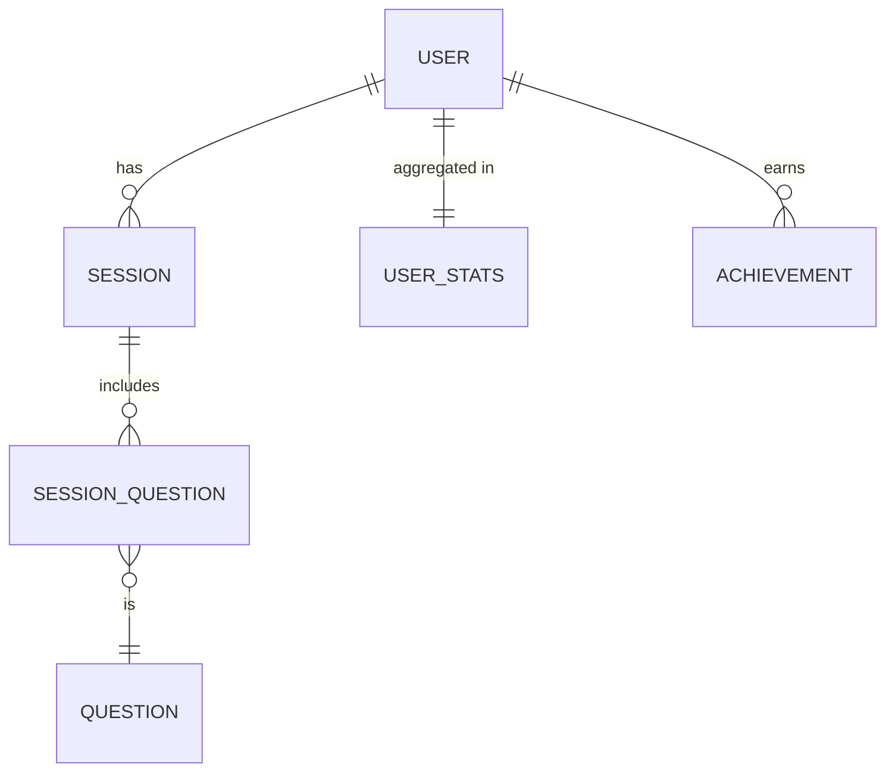
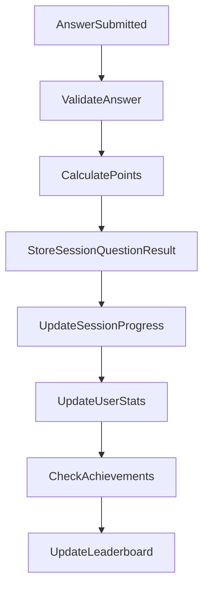
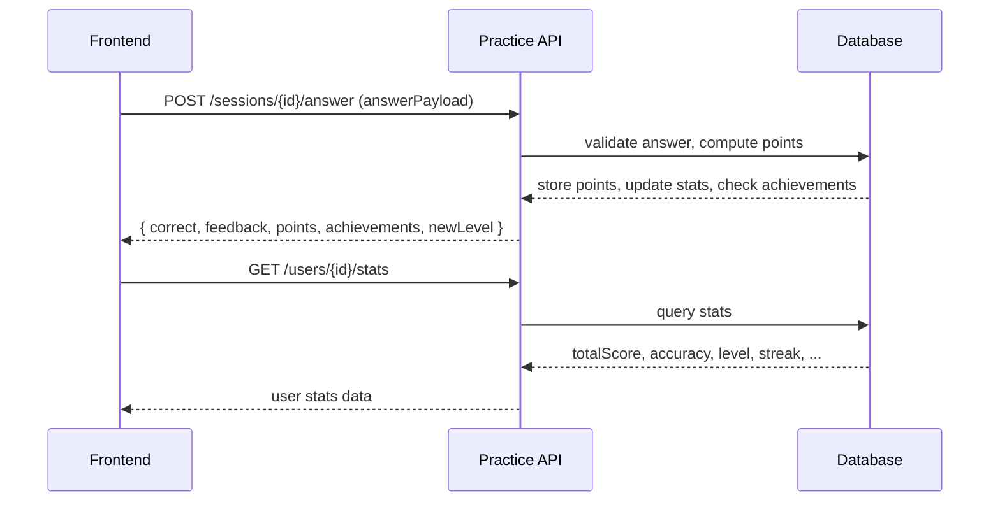

## 2. Technikai Architektúra

### 2.1. Fő entitások és kapcsolatok




### 2.2. Főtáblák

- **USER:** id, displayName, ...
- **SESSION:** id, userId, language, difficulty, createdAt
- **SESSION_QUESTION:** id, sessionId, questionId, answered, correct, pointsEarned, answeredAt
- **QUESTION:** id, type, language, difficulty, content
- **USER_STATS:** userId, totalScore, xp, currentLevel, streak, accuracy, lastSessionAt
- **ACHIEVEMENT:** id, name, type, description, points
- **USER_ACHIEVEMENT:** userId, achievementId, dateClaimed


### 2.3. Számítások, aggregációk

#### Pontszámítás menet

- Answer submission -> kiértékelés -> pontszámítás -> session/question update -> user_stats update -> achievement check




#### Aggregált statisztika frissítés

- Minden session/befejezett kérdés után recalculál:
    - **totalScore** += pontok
    - **accuracy** = helyes válaszok / összes válasz
    - **streak** = egymás után helyes válaszok száma
    - **currentLevel** = szint XP szerint
    - **lastSessionAt** = utolsó session időpontja


#### Példák lekérdezésekre

- Legjobb napi/heti/havi/top pontszám

```sql
SELECT userId, SUM(pointsEarned) as dailyScore
FROM session_question
WHERE answeredAt > CURRENT_DATE - INTERVAL 1 DAY
GROUP BY userId
ORDER BY dailyScore DESC
LIMIT 10;
```

- Felhasználó achievementjei lekérdezve

```sql
SELECT a.name, a.description, ua.dateClaimed
FROM USER_ACHIEVEMENT ua
JOIN ACHIEVEMENT a ON ua.achievementId = a.id
WHERE ua.userId = ?
```


### 2.4. API kapcsolatok, adatút



