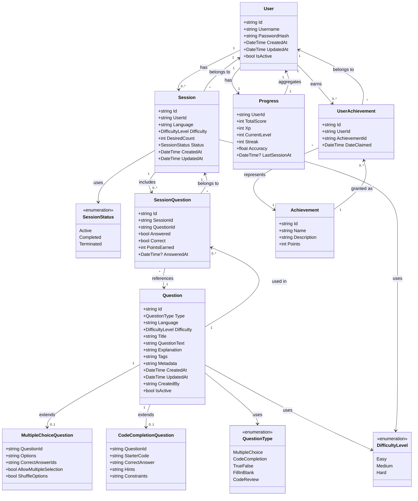
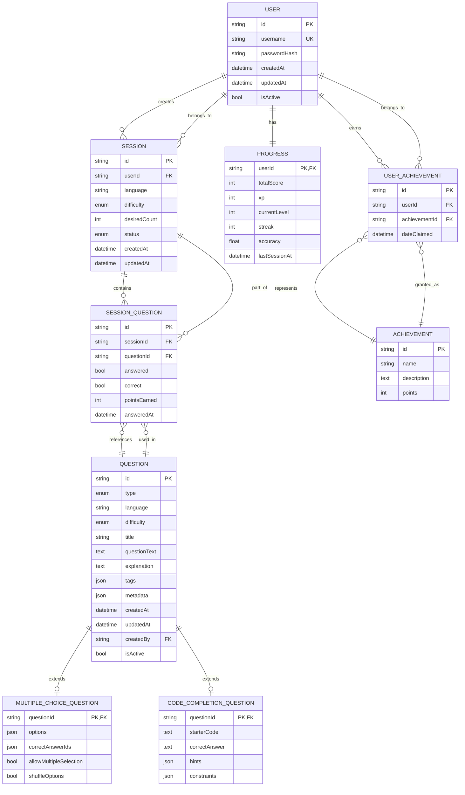

# Entity Relationships Documentation

**Document Version:** 1.0
**Last Updated:** 2025-10-05
**Status:** Draft

> ⚠️ **Living Document!**  
> This file is **continuously updated** on the *dev* branch.  
> It must be **kept in sync** with both the latest API contracts and the actual implementation.  
> The document must always reflects the **current state of the development environment**.

***

## 1. Class Diagram (Angular / Domain Model)

***

## 2. Database Entity Relationship Diagram (ERD)

***

## 3. Entity Types and Fields

### User

| Field | Type | Notes |
| :-- | :-- | :-- |
| id | VARCHAR(36) | Primary Key (GUID) |
| username | VARCHAR(50) | Unique, Required |
| passwordHash | VARCHAR(255) | Hashed password, Required |
| createdAt | DATETIME | Timestamp, Default: UTC Now |
| updatedAt | DATETIME | Timestamp, Default: UTC Now |
| isActive | BOOLEAN | Account active status, Default: true |

**Note:** Email field removed - authentication is username + password only.

***

### Question

| Field | Type | Notes |
| :-- | :-- | :-- |
| id | VARCHAR(36) | Primary Key (GUID) |
| type | ENUM | QuestionType: MultipleChoice, CodeCompletion, TrueFalse, FillInBlank, CodeReview |
| language | VARCHAR(20) | Programming language, Required |
| difficulty | ENUM | DifficultyLevel: Easy, Medium, Hard |
| title | VARCHAR(255) | Short descriptive title, Required |
| questionText | TEXT | Full question content, Required |
| explanation | TEXT | Explanation/feedback text |
| tags | JSON | Tags array (string[]) |
| metadata | JSON | Category, topic, source, version, usage stats |
| createdAt | DATETIME | Timestamp, Default: UTC Now |
| updatedAt | DATETIME | Timestamp, Default: UTC Now |
| createdBy | VARCHAR(36) | FK to User (question author) |
| isActive | BOOLEAN | Active flag, Default: true |

***

### MultipleChoiceQuestion

| Field | Type | Notes |
| :-- | :-- | :-- |
| questionId | VARCHAR(36) | Primary Key \& FK to Question |
| options | JSON | Array of AnswerOption objects {id, text, isCorrect} |
| correctAnswerIds | JSON | Array of correct option IDs (string[]) |
| allowMultipleSelection | BOOLEAN | Single or multiple correct answers, Default: false |
| shuffleOptions | BOOLEAN | Randomize option order, Default: true |

***

### CodeCompletionQuestion

| Field | Type | Notes |
| :-- | :-- | :-- |
| questionId | VARCHAR(36) | Primary Key \& FK to Question |
| starterCode | TEXT | Code template/skeleton, Required |
| correctAnswer | TEXT | Expected answer/solution, Required |
| hints | JSON | Array of hint strings (string[]) |
| constraints | JSON | CodeConstraints object: maxLines, allowedKeywords, forbiddenKeywords, timeout |

***

### Session

| Field | Type | Notes |
| :-- | :-- | :-- |
| id | VARCHAR(36) | Primary Key (GUID) |
| userId | VARCHAR(36) | FK to User, Required |
| language | VARCHAR(20) | Session programming language, Required |
| difficulty | ENUM | DifficultyLevel: Easy, Medium, Hard |
| desiredCount | INT | Number of questions requested, Required |
| status | ENUM | SessionStatus: Active, Completed, Terminated, Default: Active |
| createdAt | DATETIME | Timestamp, Default: UTC Now |
| updatedAt | DATETIME | Timestamp, Default: UTC Now |

***

### SessionQuestion

| Field | Type | Notes |
| :-- | :-- | :-- |
| id | VARCHAR(36) | Primary Key (GUID) |
| sessionId | VARCHAR(36) | FK to Session, Required |
| questionId | VARCHAR(36) | FK to Question, Required |
| answered | BOOLEAN | Whether answered, Default: false |
| correct | BOOLEAN | Whether answered correctly, Default: false |
| pointsEarned | INT | Points earned for this question, Default: 0 |
| answeredAt | DATETIME | Timestamp of answer, Nullable |

***

### Progress

| Field | Type | Notes |
| :-- | :-- | :-- |
| userId | VARCHAR(36) | Primary Key \& FK to User |
| totalScore | INT | Aggregate score across all sessions, Default: 0 |
| xp | INT | Experience points, Default: 0 |
| currentLevel | INT | User level, Default: 1 |
| streak | INT | Current consecutive correct answers, Default: 0 |
| accuracy | FLOAT | Correct answers rate (0.0 - 1.0), Default: 0.0 |
| lastSessionAt | DATETIME | Last session date, Nullable |

**Note:** This is a 1-to-1 relationship with User (one Progress record per User).

***

### Achievement

| Field | Type | Notes |
| :-- | :-- | :-- |
| id | VARCHAR(36) | Primary Key (GUID) |
| name | VARCHAR(100) | Achievement title, Required |
| description | TEXT | Explanation, Required |
| points | INT | Points awarded for unlocking, Default: 0 |

***

### UserAchievement

| Field | Type | Notes |
| :-- | :-- | :-- |
| id | VARCHAR(36) | Primary Key (GUID) |
| userId | VARCHAR(36) | FK to User, Required |
| achievementId | VARCHAR(36) | FK to Achievement, Required |
| dateClaimed | DATETIME | Timestamp of achievement claim, Default: UTC Now |

**Note:** Junction table for many-to-many relationship between User and Achievement.

***
