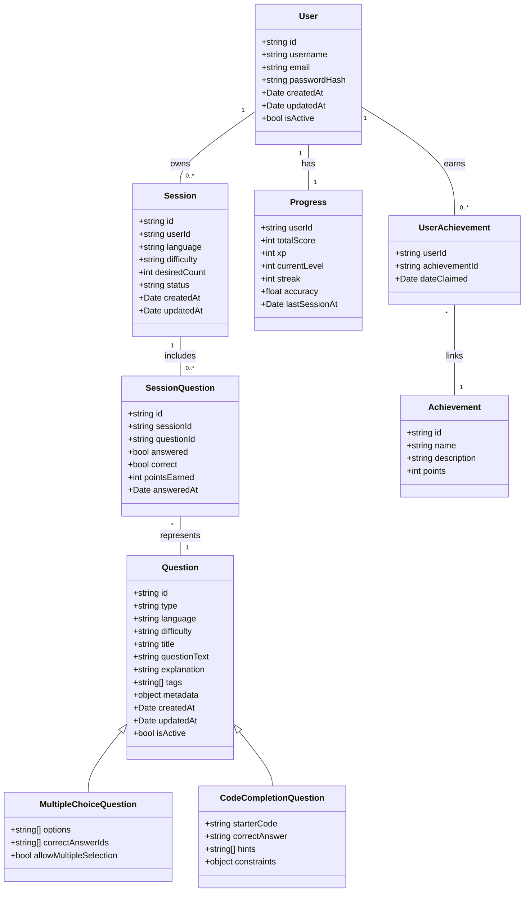
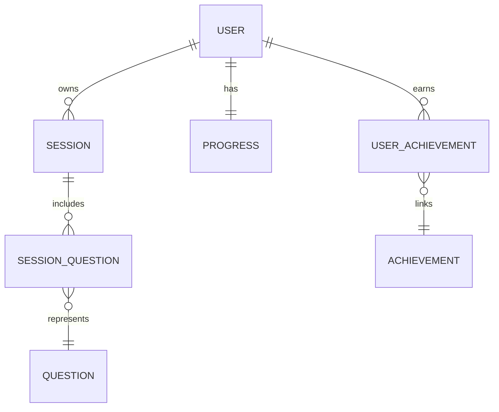

# Entity Relationships Documentation

**Document Version:** 1.0
**Last Updated:** 2025-10-05
**Status:** Draft

> ⚠️ **Living Document!**  
> This file is **continuously updated** on the *dev* branch.  
> It must be **kept in sync** with both the latest API contracts and the actual implementation.  
> The document must always reflects the **current state of the development environment**.

***

## 1. Class Diagram (Angular / Domain Model)

***

## 2. Database Entity Relationship Diagram (ERD)

***

## 3. Entity Types and Fields

### User

| Field | Type | Notes |
| :-- | :-- | :-- |
| id | VARCHAR(36) | Primary Key |
| username | VARCHAR(50) | Unique |
| email | VARCHAR(255) | Unique, verified |
| passwordHash | VARCHAR(255) | Hashed password |
| createdAt | DATETIME | Timestamp |
| updatedAt | DATETIME | Timestamp |
| isActive | BOOLEAN | Account active status |

### Question

| Field | Type | Notes |
| :-- | :-- | :-- |
| id | VARCHAR(36) | Primary Key |
| type | ENUM | MC, CODE, TF, etc. |
| language | VARCHAR(20) | Programming language |
| difficulty | ENUM | easy, medium, hard |
| title | VARCHAR(255) | Short descriptive title |
| questionText | TEXT | Full question content |
| explanation | TEXT | Explanation/feedback text |
| tags | JSON | Tags array |
| metadata | JSON | Version, usage stats |
| createdAt | DATETIME | Timestamp |
| updatedAt | DATETIME | Timestamp |
| isActive | BOOLEAN | Active flag |

### MultipleChoiceQuestion

| Field | Type | Notes |
| :-- | :-- | :-- |
| questionId | VARCHAR(36) | FK to Question |
| options | JSON | Array of answer options |
| correctAnswerIds | JSON | Array of correct option IDs |
| allowMultipleSelection | BOOLEAN | Single or multiple correct answers |

### CodeCompletionQuestion

| Field | Type | Notes |
| :-- | :-- | :-- |
| questionId | VARCHAR(36) | FK to Question |
| starterCode | TEXT | Code template |
| correctAnswer | TEXT | Expected answer string |
| hints | JSON | Array of hint strings |
| constraints | JSON | Execution constraints |

### Session

| Field | Type | Notes |
| :-- | :-- | :-- |
| id | VARCHAR(36) | Primary Key |
| userId | VARCHAR(36) | FK to User |
| language | VARCHAR(20) | Session language |
| difficulty | ENUM | Session difficulty |
| desiredCount | INT | Number of questions requested |
| status | VARCHAR(20) | e.g. Active, Completed |
| createdAt | DATETIME | Timestamp |
| updatedAt | DATETIME | Timestamp |

### SessionQuestion

| Field | Type | Notes |
| :-- | :-- | :-- |
| id | VARCHAR(36) | Primary Key |
| sessionId | VARCHAR(36) | FK to Session |
| questionId | VARCHAR(36) | FK to Question |
| answered | BOOLEAN | Whether answered |
| correct | BOOLEAN | Whether answered correctly |
| pointsEarned | INT | Points earned |
| answeredAt | DATETIME | Timestamp of answer |

### Progress

| Field | Type | Notes |
| :-- | :-- | :-- |
| userId | VARCHAR(36) | FK to User |
| totalScore | INT | Aggregate score |
| xp | INT | Experience points |
| currentLevel | INT | User level |
| streak | INT | Consecutive correct answers |
| accuracy | FLOAT | Correct answers rate |
| lastSessionAt | DATETIME | Last session date |

### Achievement

| Field | Type | Notes |
| :-- | :-- | :-- |
| id | VARCHAR(36) | Primary Key |
| name | VARCHAR(100) | Achievement title |
| description | TEXT | Explanation |
| points | INT | Points awarded |

### UserAchievement

| Field | Type | Notes |
| :-- | :-- | :-- |
| userId | VARCHAR(36) | FK to User |
| achievementId | VARCHAR(36) | FK to Achievement |
| dateClaimed | DATETIME | Timestamp of achievement claim |

***
