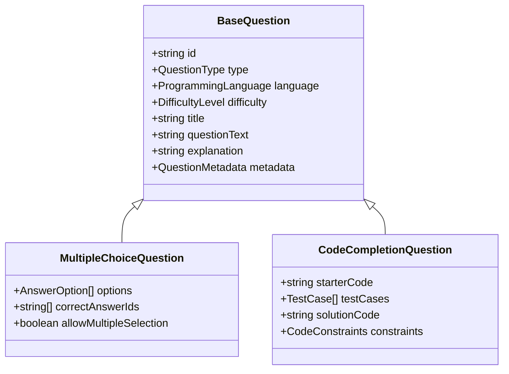

# Question Data Structures

**Document Version:** 1.0
**Last Updated:** 2025-10-05
**Status:** Draft - Pending Approval

## 1. Executive Summary

This document defines the comprehensive data structures for question types in CodeLingo, focusing on multiple choice and code completion questions. It establishes metadata schemas, storage formats, validation rules, and extensibility patterns for future question types.

***

## 2. Overview

### 2.1. Question Type Categories

CodeLingo supports two primary question types with room for extensibility:


| Type | Code | Description | Implementation Priority |
| :-- | :-- | :-- | :-- |
| Multiple Choice | `MC` | Single or multi-select with predefined options | Phase 1 |
| Code Completion | `CODE` | Programming code writing with test cases | Phase 1 |
| True/False | `TF` | Binary choice questions | Future |
| Fill-in-the-Blank | `FIB` | Text completion | Future |
| Code Review | `REVIEW` | Code analysis and bug finding | Future |

### 2.2. Design Principles

1. **Type Safety**: Strong typing with discriminated unions
2. **Extensibility**: New question types without breaking changes
3. **Validation**: Client and server-side validation rules
4. **Security**: Answer validation server-side only

***

## 3. Core Data Structures

### 3.1. Base Question Interface

All question types inherit from a base structure:

```typescript
interface BaseQuestion {
  id: string;
  type: QuestionType;
  language: ProgrammingLanguage;
  difficulty: DifficultyLevel;
  title: string;
  questionText: string;
  explanation: string;
  tags: string[];
  metadata: QuestionMetadata;
  createdAt: Date;
  updatedAt: Date;
  createdBy: string;
  isActive: boolean;
}

enum QuestionType {
  MULTIPLE_CHOICE = 'MC',
  CODE_COMPLETION = 'CODE',
  TRUE_FALSE = 'TF',
  FILL_IN_BLANK = 'FIB',
  CODE_REVIEW = 'REVIEW'
}

enum DifficultyLevel {
  EASY = 'easy',
  MEDIUM = 'medium',
  HARD = 'hard'
}

type ProgrammingLanguage = 'csharp' | 'javascript' | 'python' | 'java' | 'cpp' | 'go';

interface QuestionMetadata {
  version: number;
  estimatedTimeSeconds: number;
  pointValue: number;
  usageCount: number;
  averageCorrectRate: number;
  lastUsedAt?: Date;
}
```


### 3.2. Type Hierarchy Diagram




***

## 4. Multiple Choice Question Structure

### 4.1. Data Model

```typescript
interface MultipleChoiceQuestion extends BaseQuestion {
  type: QuestionType.MULTIPLE_CHOICE;
  options: AnswerOption[];
  correctAnswerIds: string[];
  allowMultipleSelection: boolean;
  shuffleOptions: boolean;
}

interface AnswerOption {
  id: string;
  text: string;
  imageUrl?: string;
  order: number;
}
```


### 4.2. JSON Example

```json
{
  "id": "mc-001",
  "type": "MC",
  "language": "csharp",
  "difficulty": "easy",
  "title": "C# String Methods",
  "questionText": "Which method is used to convert a string to uppercase in C#?",
  "explanation": "The ToUpper method converts all characters in a string to uppercase. It returns a new string without modifying the original.",
  "tags": ["strings", "methods", "basics"],
  "options": [
    {
      "id": "opt-1",
      "text": "ToUpper()",
      "order": 1
    },
    {
      "id": "opt-2",
      "text": "UpperCase()",
      "order": 2
    },
    {
      "id": "opt-3",
      "text": "toUpperCase()",
      "order": 3
    },
    {
      "id": "opt-4",
      "text": "Upper()",
      "order": 4
    }
  ],
  "correctAnswerIds": ["opt-1"],
  "allowMultipleSelection": false,
  "shuffleOptions": true,
  "metadata": {
    "version": 1,
    "estimatedTimeSeconds": 30,
    "pointValue": 10,
    "usageCount": 145,
    "averageCorrectRate": 0.82
  },
  "createdAt": "2025-01-15T10:00:00Z",
  "updatedAt": "2025-01-15T10:00:00Z",
  "createdBy": "admin-001",
  "isActive": true
}
```

***

## 5. Code Completion Question Structure (Simple)

### 5.1. Data Model

```typescript
interface CodeCompletionQuestion extends BaseQuestion {
  type: QuestionType.CODE_COMPLETION;
  starterCode: string;        // The code template for the user to complete
  correctAnswer: string;      // The exact expected answer string (for auto-evaluation)
  hints: string[];
  constraints: CodeConstraints;
}

interface CodeConstraints {
  maxLines: number;
  maxCharacters: number;
  forbiddenKeywords: string[];
}
```


### 5.2. JSON Example

```json
{
  "id": "code-001",
  "type": "CODE",
  "language": "python",
  "difficulty": "medium",
  "title": "Function Signature Completion",
  "questionText": "Complete the following Python function header.",
  "explanation": "The header should define a function add_numbers that takes two integer parameters.",
  "tags": ["functions", "syntax", "completion"],
  "starterCode": "def ",
  "correctAnswer": "add_numbers(a, b):",
  "hints": [
    "Use the syntax def functionName(n1, n2):",
    "No default values required"
  ],
  "constraints": {
    "maxLines": 1,
    "maxCharacters": 35,
    "forbiddenKeywords": ["import", "exec"]
  },
  "metadata": {
    "version": 1,
    "estimatedTimeSeconds": 45,
    "pointValue": 10,
    "usageCount": 32,
    "averageCorrectRate": 0.77
  },
  "createdAt": "2025-01-15T10:00:00Z",
  "updatedAt": "2025-01-15T10:00:00Z",
  "createdBy": "admin-001",
  "isActive": true
}
```

## 6. Question Import/Export Formats

### 6.1. Supported Formats

| Format | Extension | Use Case | Priority |
| :-- | :-- | :-- | :-- |
| JSON | `.json` | API integration, backup | High |


## 7. Extensibility \& Future Question Types

### 7.1. Adding New Question Types

To add a new question type, follow this pattern:

1. **Define Type Enum:**
```typescript
enum QuestionType {
  // ... existing types
  TRUE_FALSE = 'TF'
}
```

2. **Create Interface:**
```typescript
interface TrueFalseQuestion extends BaseQuestion {
  type: QuestionType.TRUE_FALSE;
  correctAnswer: boolean;
  explanation: string;
}
```

3. **Add Discriminated Union:**
```typescript
type Question = 
  | MultipleChoiceQuestion 
  | CodeCompletionQuestion 
  | TrueFalseQuestion;
```

4. **Update Validation Rules**
5. **Create Component Renderer**
6. **Add Database Migration**
