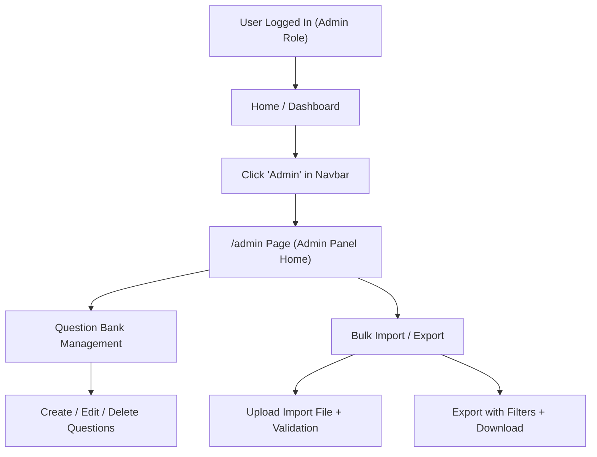
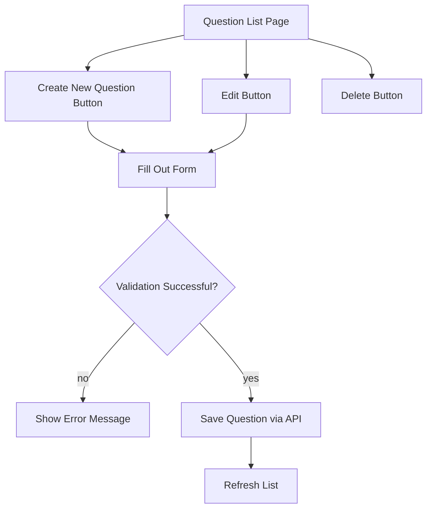
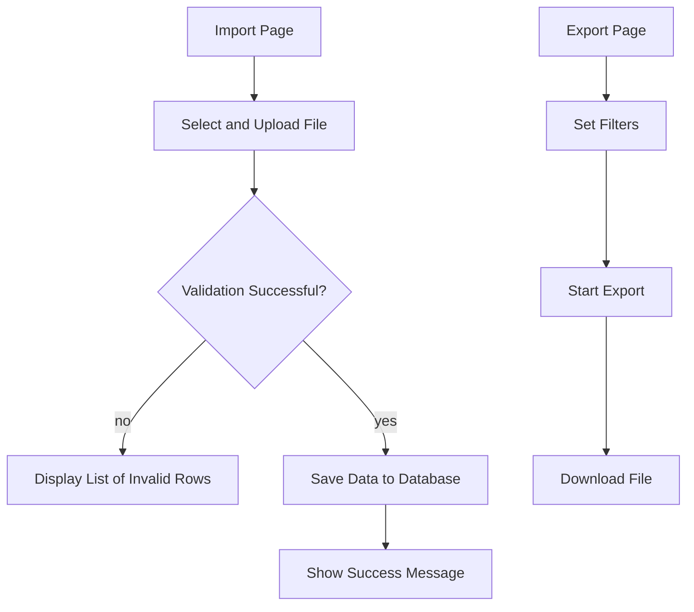

# Admin Panel User Flow

**Document Version:** 1.0
**Last Updated:** 2025-10-07
**Status:** Draft

---

## 1. Overview

This document outlines the user workflows within the Admin Panel, covering:

- Question Bank CRUD operations
- Bulk import with validation feedback
- Export functionality with filtering options

---

## 2. High-Level Journey

## 3. Detailed Step-by-Step Flow

### 3.1. Question Bank CRUD Operations

- **List view with filters** (type, difficulty, category)
- **Create new question:** fill out form, perform validation
- **Edit:** modify existing question, save version
- **Delete:** confirmation prompt before deletion
- **Errors:** missing required fields, duplicate question, API error

### 3.2. Import/Export

**Import:**

- Upload CSV or Aiken file
- Backend validation (fields, format, duplicates)
- Feedback report (successful / failed rows)

**Export:**

- Apply filters (e.g., category, difficulty, date)
- Start export (CSV or Aiken format)
- Generate downloadable file

