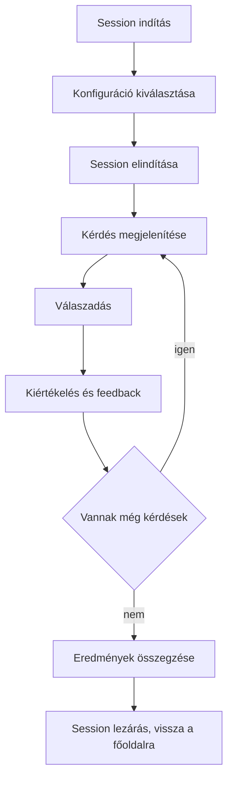
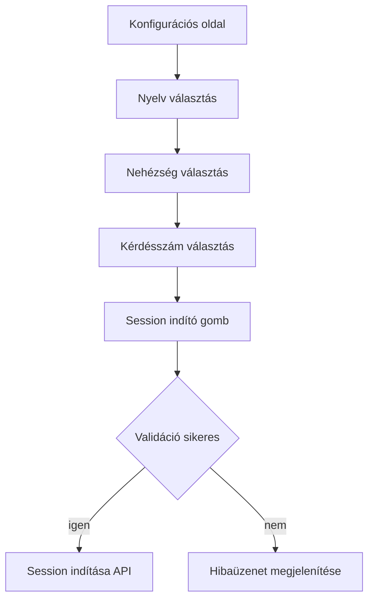
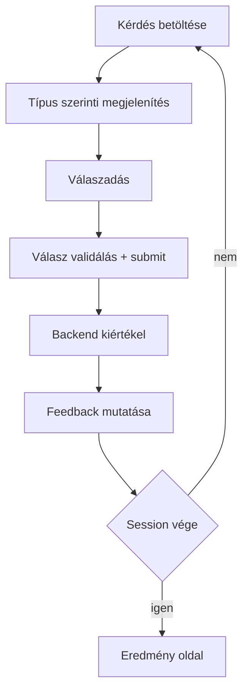
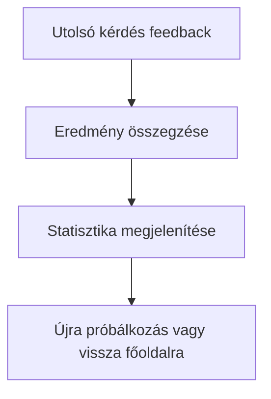

# Practice Session User Flow

**Document Version:** 1.0
**Last Updated:** 2025-10-05
**Status:** Draft

## 1. Overview

Ez a dokumentum végigköveti a felhasználó útját egy CodeLingo Practice Session során:

- Session setup
- Kérdés prezentáció
- Válaszadás
- Azonnali feedback
- Előrehaladás mutatása
- Eredmény megjelenítése
- Hiba/leállás/újraindítás forgatókönyvek

***

## 2. High-Level Journey

***

## 3. Detailed Step-by-Step Flow

### 3.1. Session Setup

- **Konfiguráció:** nyelv, nehézség, kérdésszám beállítása
- **Session indítása**: API hívás, session azonosító visszakapása
- **Hiba:** helytelen beállítások – azonnali validáció, értesítés a felhasználónak

### 3.2. Kérdés prezentáció \& válaszadás ciklus

- **Kérdés betöltése:** backend-ből, session állapot alapján
- **Kérdés típus:** MC vagy code completion
- **Válaszadás:** kliens validáció, submit
- **Azonnali feedback:** helyes vagy helytelen, magyarázat, pont
- **Továbblépés:** feedback után folytatás vagy session vége

### 3.3. Eredmény és session lezárás

- **Eredmény aggregáció:** összpont, helyes válaszok, accuracy, új szint/achievement
- **Summary:** felhasználói chart, fejlesztési tippek
- **Navigáció:** új session/ főoldal felé visszairányítás lehetősége

***
