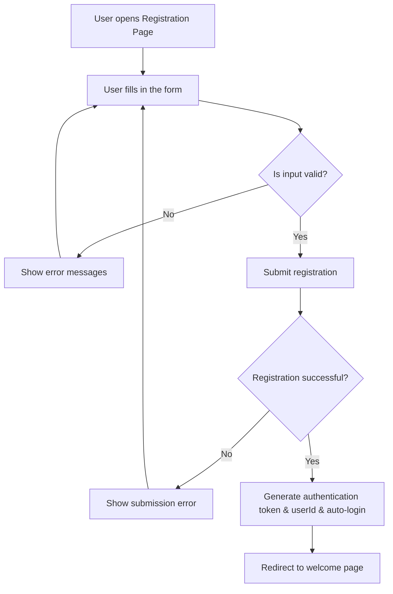

# User Registration Flow

**Document Version:** 1.0
**Last Updated:** 2025-10-12
**Status:** Draft

## Description
This document outlines the complete user registration and onboarding journey for **CodeLingo**.  
It maps the step-by-step process from initial signup to profile setup completion.
## Class Diagram
The diagram below shows the registration process including validation, submission, and auto-login:

## Performance & Security requirements
- Validation should be fast and smooth
- Password should be hashed
- Token based authentication with autologin (as we learned before)
- Defend against SQL injection 
- HTTPS
- Defend against bots (rate limiting? captcha?)
## Onboarding Experience
- later